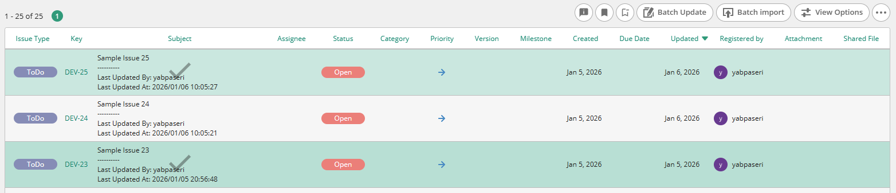
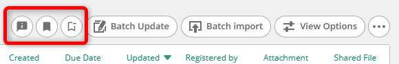
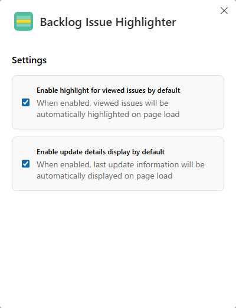

# Backlog Issue Highlighter

[en]  
A browser extension that enhances Backlog's issue list with the following features:

- **Highlight viewed issues**: Automatically highlights issues you have clicked on, making it easy to track which issues you've already reviewed.
- **Display last update information**: Shows the last updater and last update date for each issue directly in the issue list.

[ja]  
Backlogの課題一覧を強化するブラウザ拡張機能です。

- **閲覧済み課題のハイライト**: クリックした課題を自動的にハイライト表示し、どの課題を確認済みか簡単に把握できます。
- **最終更新情報の表示**: 各課題の最終更新者と最終更新日を課題一覧に直接表示します。

## Screenshots / スクリーンショット



### Control Buttons / コントロールボタン



[en]  
Control buttons are added to the issue list header:

- Toggle update details display on/off
- Toggle highlight on/off
- Reset viewed issues history

[ja]  
課題一覧のヘッダーにコントロールボタンが追加されます:

- 最終更新情報の表示ON/OFF切り替え
- ハイライトのON/OFF切り替え
- 閲覧済み課題の記録をリセット

### Options Page / 設定画面



[en]  
Configure default settings from the extension options page:

- Enable/disable highlight by default
- Enable/disable update details display by default

[ja]  
拡張機能の設定画面からデフォルト設定を変更できます:

- ハイライトのデフォルトON/OFF
- 最終更新情報表示のデフォルトON/OFF

## Install / インストール

[en]  
Install from Chrome Web Store (coming soon).

[ja]  
Chrome ウェブストアからインストールしてください（準備中）。

<!-- https://chromewebstore.google.com/detail/xxxxx -->

## Usage / 使い方

[en]

1. Navigate to any Backlog project's issue list page.
2. Click on an issue to mark it as viewed - it will be highlighted.
3. Use the control buttons to toggle features or reset history.
4. Right-click the highlight toggle button on an issue row to toggle its highlight state.

[ja]

1. Backlogプロジェクトの課題一覧ページにアクセスします。
2. 課題をクリックすると閲覧済みとしてハイライト表示されます。
3. コントロールボタンで機能のON/OFFや履歴のリセットができます。
4. 課題行のハイライトトグルボタンを右クリックすると、ハイライト状態を切り替えられます。

## Supported Sites / 対応サイト

- `*.backlog.com`
- `*.backlog.jp`

## Development / 開発

```bash
# Install dependencies
bun install

# Start development server (Chrome)
bun dev

# Start development server (Firefox)
bun dev:firefox

# Build for production (Chrome)
bun build

# Build for production (Firefox)
bun build:firefox

# Create zip for distribution
bun zip
bun zip:firefox
```

## Tech Stack / 技術スタック

- [WXT](https://wxt.dev/) - Web Extension Framework
- [React](https://react.dev/) - UI Library
- [TypeScript](https://www.typescriptlang.org/) - Type Safety
- [Bun](https://bun.sh/) - JavaScript Runtime & Package Manager

## License / ライセンス

MIT
